# Walton Hi-Tech Industries PLC – DCF Valuation & Financial Analysis
A comprehensive financial modeling and valuation project for Walton Hi-Tech Industries PLC, a leading Bangladeshi consumer electronics manufacturer. This repository contains detailed financial statement models, DCF valuation analysis, sensitivity testing, and supporting documentation.

## 🎯 Project Overview

### Objective

To determine the **intrinsic equity value per share** of Walton Hi-Tech Industries PLC using industry-standard discounted cash flow (DCF) methodology, incorporating detailed financial forecasting, capital structure analysis, and sensitivity testing.

### Business Analysis: Walton Hi-Tech Industries PLC

Walton Hi-Tech Industries PLC is Bangladesh's leading vertically integrated manufacturer of consumer electronics and appliances. The company has established a dominant market position, holding over 65% share in the refrigerator market and approximately 40% in air conditioners, fueled by a strategic vertical integration model that allows it to manufacture 80% of components in-house. 

#### Business Model & Revenue Streams

##### Core Product Portfolio
*   **Refrigerators & Freezers** (62% of Revenue): Market leader with >65% domestic share.
*   **Home & Electrical Appliances** (12.5%): Includes washing machines and kitchen appliances.
*   **Air Conditioning Systems** (8.7%): ~40% domestic market share.
*   **Televisions** (5.1%): Competing against premium imported brands.
*   **Expanding Categories:** Laptops, smartphones, electric mobility, and lithium-ion batteries (commencing 2026).

##### Vertical Integration: The Competitive Moat
Walton operates 22 production facilities manufacturing key components in-house:
*   **Compressors:** 1.5 million units annual capacity (only domestic manufacturer)
*   **Plastic & Metal Components:** Full control from raw materials to finished parts
*   **PCB Manufacturing:** Enhanced capability post-Digi-Tech merger [(*Digi-Tech Merger*)](https://www.tbsnews.net/economy/industry/walton-hi-tech-merge-digi-tech-business-expansion-cost-cutting-1229276)
*   **Impact:** Estimated 8-12% cost advantage over import-dependent competitors

##### Revenue Distribution & Sales Channels
*   **B2C Retail (85%+):** 21,000+ retail outlets including 1,000+ "Walton Plaza" branded stores
*   **Export Sales (7%):** Growing at 45.8% annually across 50+ countries
*   **B2B Component Sales (8%):** Selling compressors to other manufacturers

##### Strategic Initiatives (2025–2028)

1. **WDIL Merger:** Vertical integration into IT products (laptops, desktops, mobile phones); High Court approval pending.  
2. **Lithium Battery Project:** 113.66 Crore capex; expected 8–10% EBIT contribution by FY2030.  
3. **Market Expansion:** Regional exports and premium product positioning.

### Key Outputs

| Metric | Value |
|--------|-------|
| **Intrinsic Value (DCF)** | BDT 393.63 per share |
| **Current Market Price** | BDT 376.60 per share |
| **Implied Upside** | 4.52% |
| **Recommendation** | HOLD |
| **WACC** | 16.71% |
| **Terminal Growth** | 4.0% |

### Investment Thesis

**Recommendation: HOLD 🧿**

This analysis views Walton Hi‑Tech as approximately fairly valued with modest upside at the current market price of BDT 376.60 versus a DCF‑implied fair value of BDT 393.63. The stock offers a balanced risk–reward profile. The company benefits from earnings recovery, new growth drivers (WDIL IT products, lithium-ion batteries), and improving liquidity, but faces macro risks and competitive pressures. A **HOLD stance** is recommended pending de-risking of major strategic initiatives.

---

## 📊 Financial Models

### 1. Revenue Forecast

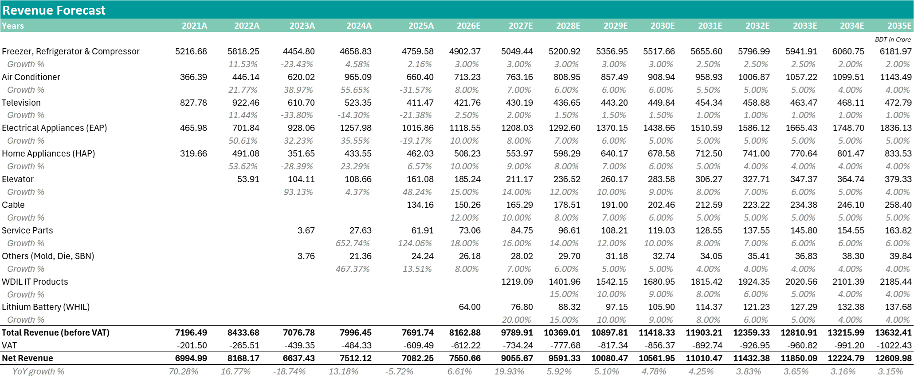

> This figure shows how different product segments are expected to grow each year from 2021 to 2035. Some years have very high growth because new products were introduced, while others show declines due to market slowdowns. From 2026 onward, growth is forecasted to become more stable, mostly between 3% and 10%. Overall, year-on-year revenue growth is expected to remain steady over time.

### 2. Projected Income Statement

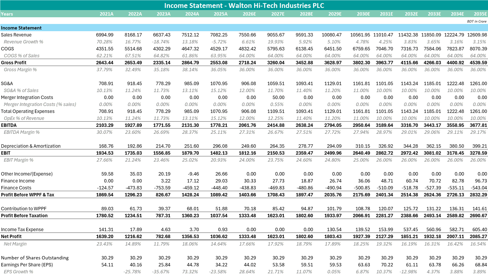

> This model shows how the company’s sales and profits are expected to grow from 2021 to 2035. It shows revenue, cost of goods sold, gross profit, operating expenses, EBITDA, EBIT, taxes, and net profit.EBIT margin drops to about 20.9% in 2025, but is expected to recover and reach 26% by 2032. Net profit margin also improves from 14.6% in 2025 to 16–19% in later years. This improvement mainly comes from better cost control as the company grows.

### 3. Projected Balance Sheet

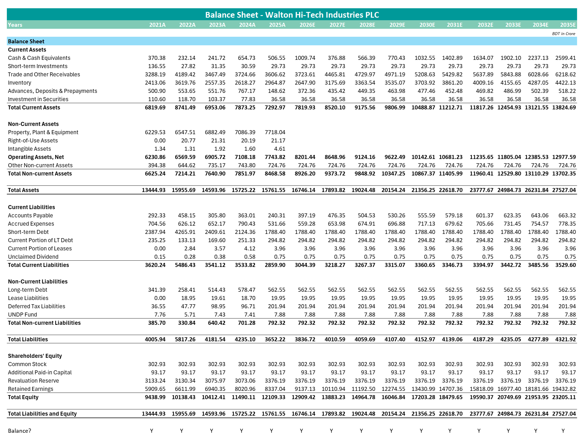

> This model shows what the company owns (cash, inventory, receivables, fixed assets) and what it owes (payables, debt, and other liabilities). It also outlines equity items like retained earnings. The company’s current ratio rises from 1.55 in 2022 to over 2.50 in 2025, meaning it becomes much better at managing short-term working capital. Debt stays the same, but leverage improves because profits and EBITDA increase. Cash grows from BDT 507 crore in 2025 to BDT 2,599 crore by 2035, which shows strong financial health and supports long-term dividend payments. 

### 4. Projected Cash Flow Statement

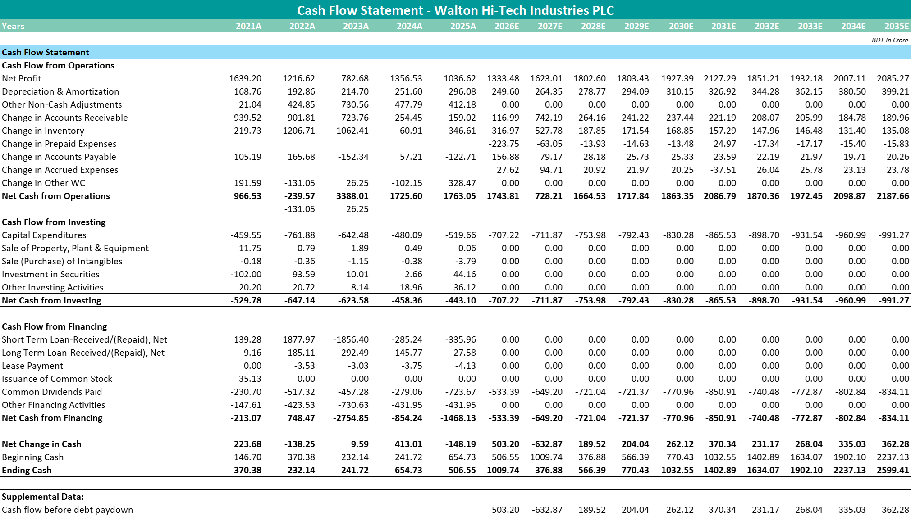

> This model covers cash from operations, investments, and financing activities. It also shows how the company’s cash balance changes over time. Operating cash flow rises from BDT 1,763 crore in 2025 to more than BDT 2,100 crore in future years, meaning the business is generating more cash from its core operations. Capex remains steady at about 7.86% of revenue, with one major investment—BDT 114 crore for a lithium project in 2026. The company follows a disciplined dividend policy, paying out 40% of earnings, which allows it to reward shareholders while still retaining enough cash for future growth.

---

## 💰 DCF Valuation Analysis

### 1. WACC Calculation Summary
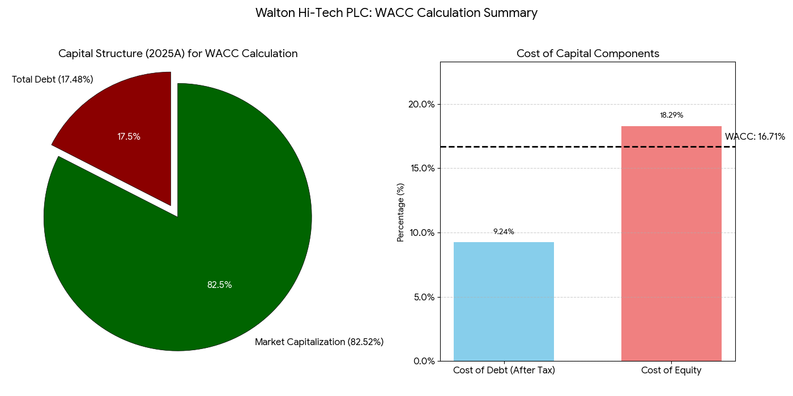

> This chart shows Walton’s capital structure and cost of capital components used in the WACC calculation. The pie chart indicates an equity‑heavy structure, with equity comprising roughly four‑fifths of financing. The bar chart compares the after‑tax cost of debt with the higher cost of equity, and the dashed line highlights the resulting weighted average cost of capital applied in the DCF valuation.

### 2. Debt Schedule & Interest Coverage

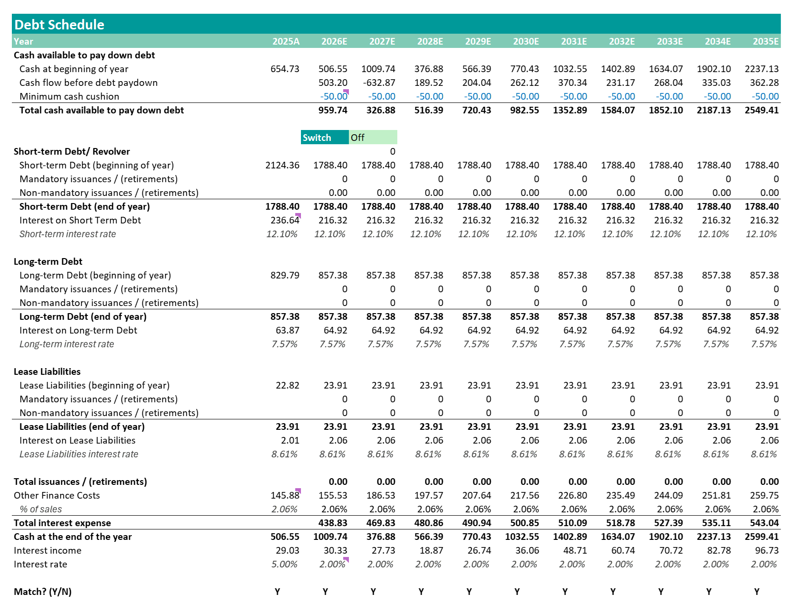

> This shows total debt composition (short-term and long-term) and interest expense calculation. Here, a minimum cash cushion of BDT 50 crores is assumed. Also, other finance costs include excise Duty, bank charges + FX loss. Interest income rate is assumed to be usually 1–3% of cash. The main issue I faced here was a circular reference error. Paul Pignataro's book and his YouTube videos have helped me fix this issue. 

### 3. DCF Value Build-Up

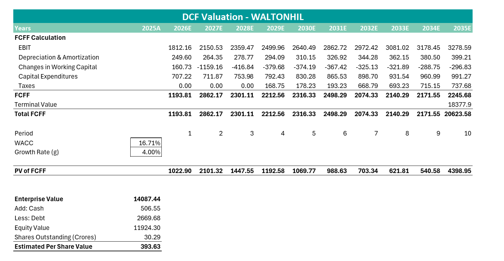

> This shows the calculation of FCFF from EBIT, the present value of a 10-year explicit forecast FCFF, the terminal value calculation (Gordon Growth model), the enterprise value composition, the bridge to equity value (debt and cash adjustments), and the per-share valuation. We found an estimated per-share value of BDT 393.63.  

---

## 📈 Key Valuation Charts

### Chart 1: Revenue Trend (2021–2035)

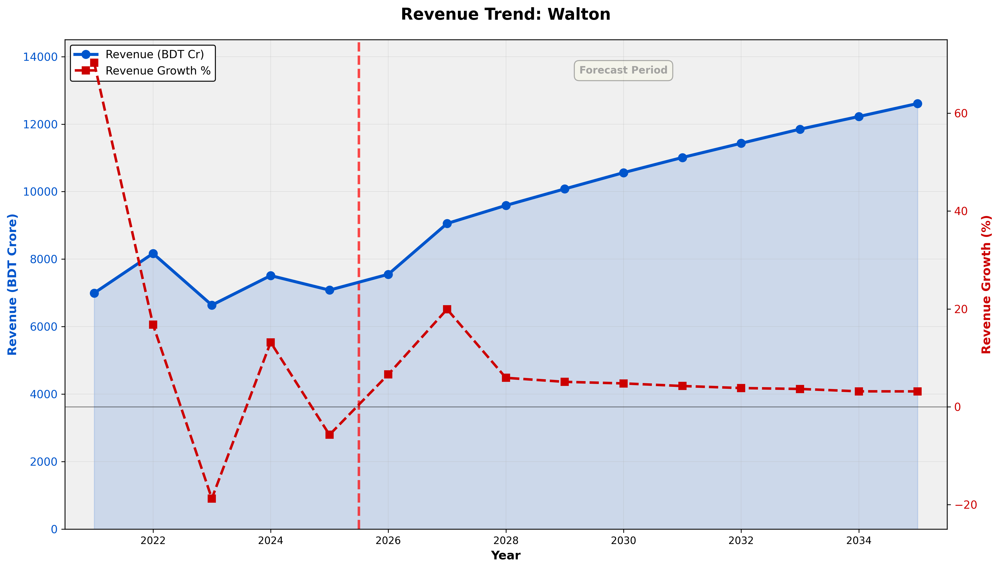

> This chart shows Walton’s net revenue and year‑on‑year growth from 2021A to 2035E. The blue line tracks absolute revenue, while the red dashed line shows growth percentages. The dotted vertical line separates historical data from forecasts. The series highlights a temporary contraction followed by recovery and then a gradual normalisation of growth as the company matures and incremental expansion moderates.

### Chart 2: Walton's Revenue by Product

> This area chart shows how Walton’s total revenue is distributed across major product segments over time. Refrigerators remain the core contributor, while air conditioners, home appliances, and service parts gradually increase their shares. New segments, particularly WDIL IT products and lithium batteries, start contributing from 2026–2027E, illustrating diversification and future growth drivers beyond the legacy refrigerator business.

### Chart 3: Operating Performance – EBIT & Margin Expansion

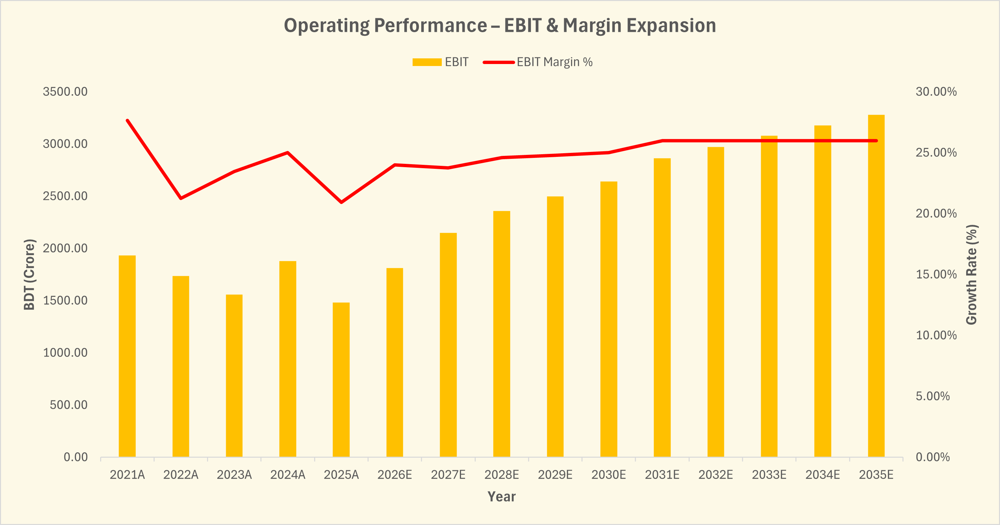

> This chart shows Walton’s operating performance by combining EBIT levels with EBIT margin percentages over time. The green bars represent absolute EBIT, while the light line tracks margin evolution. The pattern indicates an initial period of margin compression followed by progressive improvement, supported by operating leverage, cost discipline, and benefits from scale and integration, leading to both rising earnings and healthier profitability ratios.

### Chart 4: Profitability Margin Analysis

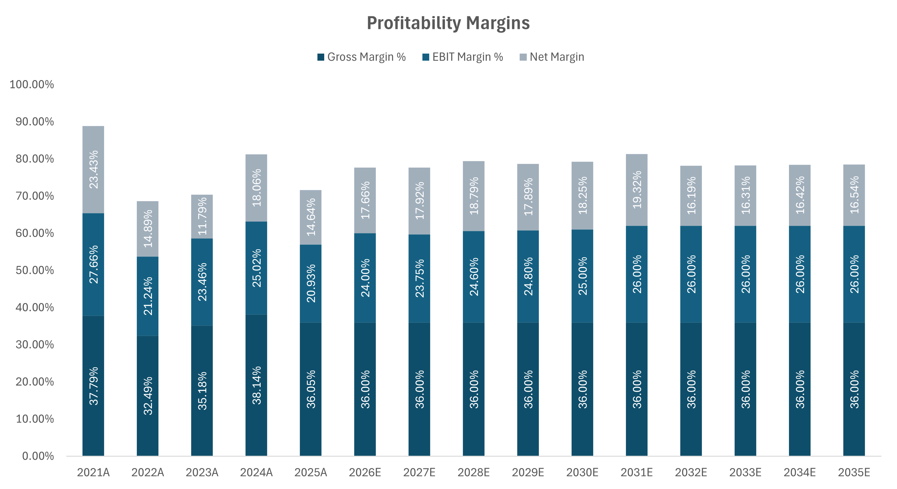

> This chart shows the evolution of gross margin, EBIT margin, and net margin across historical and forecast years. Gross margin stabilises around 36%, while EBIT and net margins dip during the stress period and gradually recover. Over the forecast horizon, margins expand as operating efficiency improves, VAT/tax incentives materialise, and higher‑margin products and services contribute more to overall profitability.

### Chart 5: Historical Liquidity Ratios 

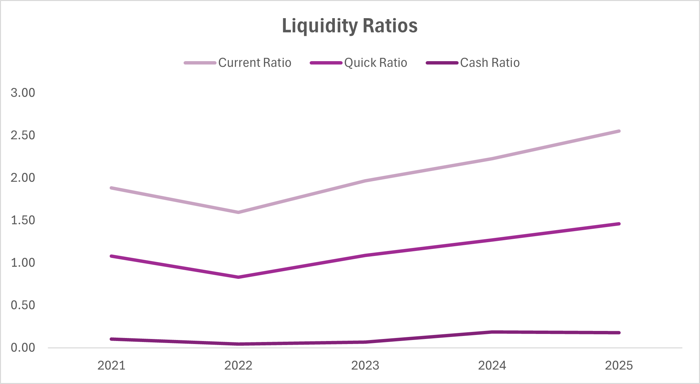

> This chart shows the trend in Walton’s current, quick, and cash ratios from 2021 to 2025. Liquidity weakens slightly around 2022 but improves steadily thereafter, with both current and quick ratios trending upwards. The pattern indicates that, despite short-term pressures, the company has strengthened its ability to cover short-term obligations, while maintaining prudent levels of cash and near‑cash assets.

### Chart 6: Earnings Per Share (EPS) Trend

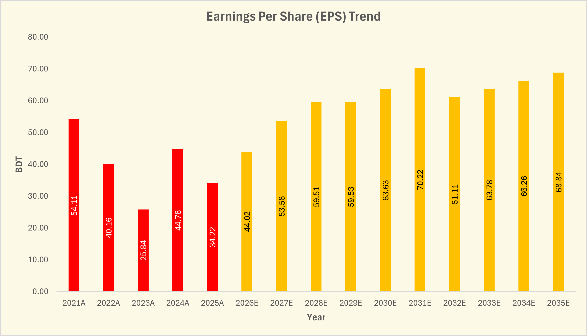

> This chart shows the historical and projected earnings per share (EPS) of Walton from 2021A to 2035E. EPS declines sharply after 2021 due to macroeconomic and operational headwinds, then begins recovering from 2026E. Over the forecast period, EPS grows steadily, reflecting profitability restoration, operating leverage, and contributions from new projects and the WDIL integration.

### Chart 7: DCF Value Build‑Up

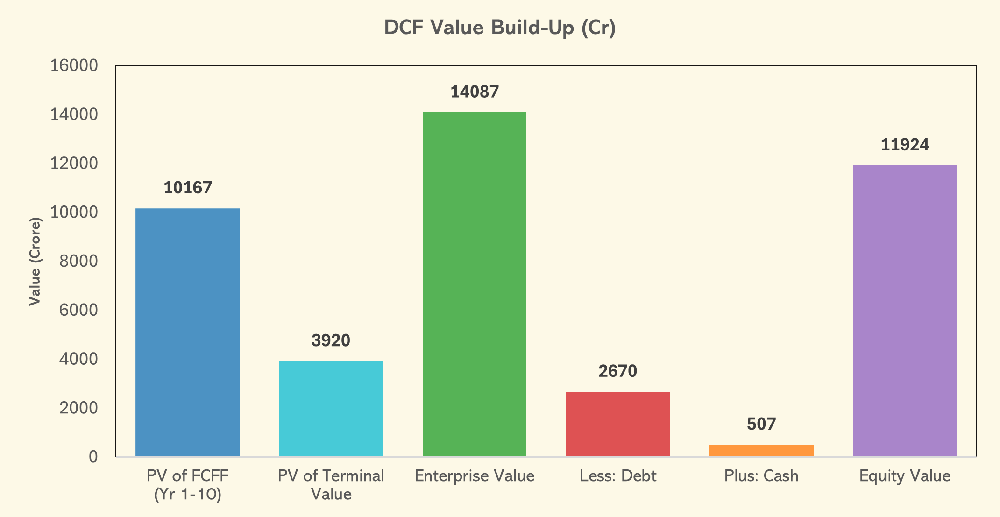

> This column chart shows how the DCF‑based equity value is constructed. The first bars present the present value of projected free cash flows and terminal value, which together form enterprise value. Subsequent bars deduct debt and add cash to arrive at total equity value. The chart provides a transparent bridge from operating performance to the final per‑share valuation figure used in the investment conclusion.

### Chart 8: DCF Sensitivity – WACC vs Terminal Growth Rate

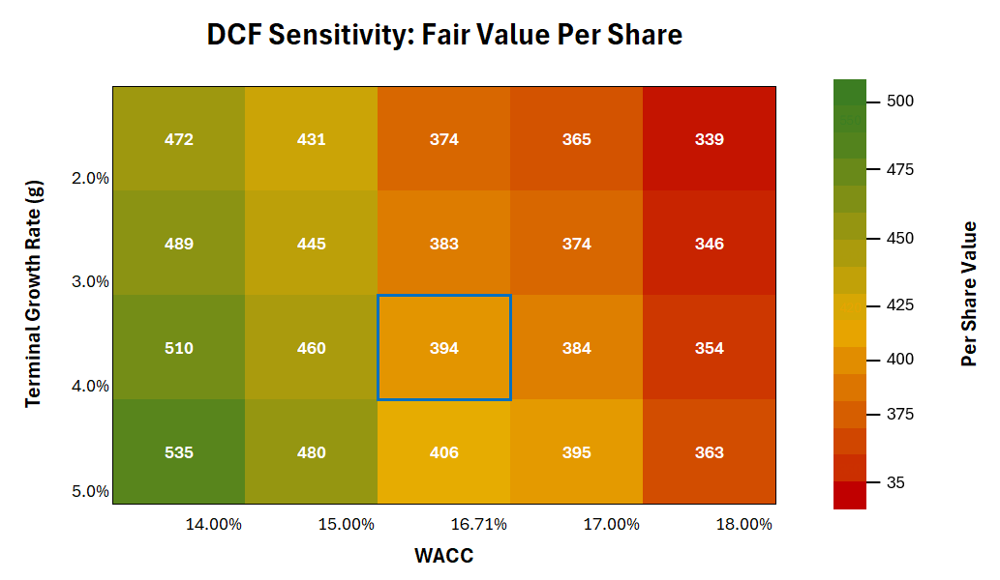

> This heatmap demonstrates how Walton’s intrinsic value per share changes under alternative combinations of WACC and terminal growth rates. Each cell reports the implied fair value, with warmer colours indicating lower values and cooler colours higher values. The blue‑outlined cell marks the base‑case assumption set. The grid visually communicates valuation risk, showing both downside scenarios and upside potential if risk perceptions or growth outlook improve.

### Chart 9: DCF Scenario Analysis

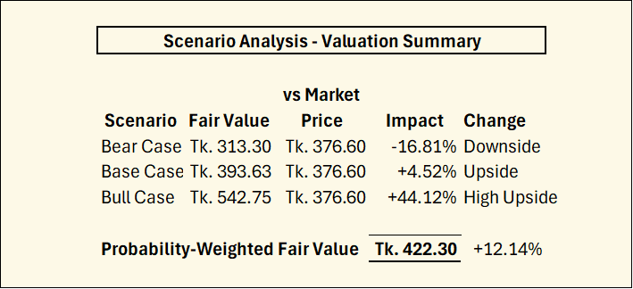

> Walton's valuation is sensitive to macro conditions and execution on strategic initiatives. We model three scenarios with the above results. The probability-weighted fair value of **Tk. 422.30** implies **12.1% upside** from the current market price of Tk. 376.60, offering a balanced risk-reward profile. The wide valuation range (Tk. 313–543) reflects material execution and macro risks that will resolve over the next 12–18 months.

**Bear Case Triggers** (Probability ↑ to 30%+):
- WDIL merger court approval delayed beyond 2026
- Lithium battery project cost overruns or market adoption fails
- Renewed FX crisis (BDT depreciates another 20%+)
- Chinese competitors enter Bangladesh market aggressively
- Consumer demand collapse from political instability

**Bull Case Triggers** (Probability ↑ to 40%+):
- WDIL merger court approval + synergies exceed expectations
- Lithium battery sales exceed 100k units/year target
- Bangladesh macro stabilizes (FX stable, inflation <5%)
- Walton expands into regional markets (India, Southeast Asia)
- Market recognizes transformation; WACC compresses 100+ bps

**Note:** Two charts have been created using Python Code with the guidance of Google Gemini. 

---

## 🔍 Key Findings & Recommendations

### Valuation Summary

| Item | Value |
|------|-------|
| DCF Fair Value (Base Case) | **Tk. 393.63** |
| Probability-Weighted Fair Value | **Tk. 422.30** |
| Current Market Price | Tk. 376.60 |
| Base Case Upside | **+4.52%** |
| Weighted Fair Value Upside | **+12.14%** |
| Valuation Range (All Scenarios | Tk. 313 – Tk. 543 |
| Risk/Reward Skew | Favorable (upside 44% vs downside -17%) |
| Recommendation | **HOLD** 🧿 |

### Positive Drivers

- **Earnings recovery:** The company’s earnings are expected to recover strongly. EPS could rise from BDT 34.22 in 2025 to BDT 68.84 by 2035, which means profits per share may double over 10 years. This steady growth comes from higher revenue, better margins, and new business lines, which supports the long-term DCF assumptions.  
- **Revenue diversification:** Revenue also becomes more diversified. Total sales may grow from BDT 7,083 crore to BDT 12,610 crore by 2035. The core refrigerator business grows slowly, but new areas like IT products, lithium batteries, elevators, and service parts grow faster. These newer segments reduce dependency on one product and open new growth opportunities.  
- **Margin improvement:** Profit margins are expected to improve. EBIT margin could rise from 20.9% to 26%, helped by VAT benefits, cost efficiency, and a better product mix. Higher-margin items—like service parts and batteries—boost earnings further. EBITDA margins stay strong, supporting healthy cash flow.  
- **Improving liquidity:** The company’s financial position also strengthens. The current ratio improves, debt levels stay stable, and cash flow rises. With better liquidity and steady free cash flow, the company can continue paying dividends comfortably.  
- **Tax incentives:** Tax benefits provide another advantage. The Hi-Tech Park policy allows a 0% tax rate until 2028, which greatly boosts cash flow. Even when tax increases gradually afterward, it remains in line with policy expectations.  

### Risk Factors

- **Macro uncertainty:** Bangladesh’s economic environment remains shaky. Inflation is high, foreign reserves have fallen, and the Taka has weakened a lot. This raises import costs and puts pressure on profit margins. Political uncertainty also adds risk to demand and business operations.  
- **Execution risk:** There are execution risks too. The merger with WDIL is still waiting for court approval. Any delay would slow down the expected revenue growth and cost synergies. Integration costs could also be higher than estimated. The lithium battery project carries some uncertainty. It assumes strong sales from 2026 onward, but market adoption, competition, or technology issues could affect performance.
- **Competitive pressure:** Competition is another risk. The refrigerator market is already saturated, and foreign brands are increasing pressure in AC and TV categories. This could limit growth and squeeze pricing.  
- **High WACC:** Finally, a high WACC of 16.71% reduces the valuation. If macroeconomic conditions worsen, WACC could rise further and lower the company’s fair value. However, if risk levels improve, WACC could come down, lifting valuation results.  

### Investment Action Items

| Action | Rationale |
|--------|-----------|
| **BUY** | Below BDT 360 ACCUMULATE (>15% margin of safety) |
| **HOLD** | Current levels (not compelling enough for aggressive buying) |
| **SELL / TRIM** | Above BDT 450 (bull case getting priced in) |

---

## 📐 Methodology & Assumptions

### Valuation Approach

**Discounted Cash Flow (DCF) – Unlevered Free Cash Flow (FCFF) Method**

- **Forecast period:** 10 years (2026E–2035E)
- **Terminal value:** Gordon Growth model with 4.0% perpetual growth
- **Discount rate:** Weighted average cost of capital (WACC) = 16.71%

### 🌱 Key Assumptions

#### Revenue Growth (by segment)

| Segment | 2026E | 2035E | Driver |
|---------|-------|-------|--------|
| Refrigerators | 3.0% | 2.0% | Mature market; VAT headwind |
| Air Conditioners | 8.0% | 4.0% | Climate change tailwind |
| Televisions | 2.5% | 1.0% | Imported competition |
| Electrical Appliances | 10.0% | 5.0% | Middle-class expansion |
| Elevators | 15.0% | 4.0% | Long-term construction growth |
| Service Parts | 18.0% | 6.0% | Recurring, installed-base driven |
| WDIL IT Products | 15.0% | 4.0% | Post-merger synergies |
| Lithium Batteries | 20.0% | 4.0% | New product ramp, then mature |

#### Profitability Assumptions

| Metric | Assumption | Rationale |
|--------|-----------|-----------|
| COGS % Sales | 64.0% | Consistent with historical; slight benefit from vertical integration |
| SG&A % Sales | 12.0% → 10.0% | Declining as merger synergies realized |
| D&A % Opening Assets | 3.22% | Historical average |
| Effective Tax Rate | 0% (FY26–28), 6.75% (29–31), 22.5% (32+) | Hi-tech park incentive phase-out |

#### Working Capital Assumptions

| Metric | 2025A | 2035E | Improvement |
|--------|------:|------:|----------:|
| Days Inventory Outstanding (DIO) | 225 | 200 | Inventory efficiency gains |
| Days Sales Outstanding (DSO) | 189 | 180 | Dealer credit tightening |
| Days Payable Outstanding (DPO) | 24 | 30 | Better supplier terms |

#### CapEx & Depreciation

- **Regular CapEx:** 7.86% of revenue (supporting growth and replacement)
- **Lithium Project CapEx:** BDT 113.66 Cr one-time in 2026E
- **D&A rate:** 3.22% of opening operating assets

#### WACC Components

- Detailed explanations can be found in the WACC_Analysis folder

#### Terminal Assumptions

- **Terminal growth rate (g):** 4.0%
It is below Bangladesh long-run nominal GDP growth (5–6%). This also ensures company does not outgrow economy in perpetuity. 

## 📌 Limitations of this Model
I acknowledge that this model has some limitations. These are as follows:
- Revenue, margin, capex, and working capital forecasts are based on assumptions rather than management guidance.
- The model is extremely sensitive to small changes in WACC and terminal growth, causing large swings in fair value.
- Beta is estimated from DSEX, which is a shallow and sometimes illiquid market. Regression-based beta for emerging markets may not reflect the true systematic risk of the company.
- For calculating depreciation & amortization, I grouped PPE, Intangible Assets, and Right-of-Use Assets as operating assets. However, Paul Pignataro showed a more detailed process for creating depreciation and working capital schedules. But due to a lack of data and expertise, I couldn't make such detailed ones. 
- I assumed Walton would successfully conduct its merger of WDIL and undertake the lithium battery project. Here, I have made some simplistic assumptions. A thorough M&A and Project analysis would lead to more accurate results.
- Forecast capex includes a large lithium battery expansion whose returns are unpredictable.
- The debt schedule has been created following Paul Pignataro's guidance. However, this could have been designed more accurately.
- Paul Pignataro showed two major methods for calculating the terminal value, including the Multiple method and the Perpetuity method. But for this project, I followed only the Perpetuity method.
- Finally, Walton reported its Cash Flow Statement using the Direct Method. But I followed the converted indirect version of the Cash Flow Statement from StockAnalysis. So, there may be some mistakes due to StockAnalysis's classification issue. 

---

## 📚 Additional Resources

### Data Sources

- **Bangladesh Bank:** 10Y government bond yields, FX rates
- **Dhaka Stock Exchange (DSE):** Historical stock prices, beta regression
- **Company Reports:** Walton's Annual reports (FY2021A–2025A)
- **Damodaran Database:** Equity risk premium, country default spreads
- **Industry reports:** Consumer durables sector analysis, growth forecasts

**Note:** Detailed sources and references are included in the Data folder.

### Tools Used

- **Microsoft Excel:** Financial modeling & DCF
- **Python / Google Colab:** Chart generation
- **Websites:** LankaBangla Financial portal, Dhaka Stock Exchange (DSE), StockAnalysis, ChatGPT & Perplexity (for research, educational, and design purposes)
- **GitHub:** Project documentation & version control

**Note:** I also followed a book called "**Financial Modeling and Valuation: A Practical Guide to Investment Banking and Private Equity**" by Paul Pignataro and **YouTube Channel:** [(Paul Pignataro)](https://youtube.com/@anextraining?si=y-K5Ga1ncVwaRtap)

## 💬 Contact & Attribution

**Project prepared by:** Ifta Hider Rahman  
**Date completed:** December 3, 2025  
**Last updated:** December 10, 2025  

For questions, feedback, or to discuss the analysis:

- 🔗 LinkedIn: [Ifta Hider Rahman](https://www.linkedin.com/in/iftahiderrahman/)
- 💻 GitHub: [@iftahaider](https://github.com/iftahaider)

## 💻 Files
Please refer to the following folders to access all components of the Walton PLC DCF Valuation project.
- `Analysis/` – Contains the full company analysis, macroeconomic review, risk factors, projected financials, and valuation breakdowns.
- `Charts/` – Visual figures and charts used in the valuation report
- `DCF_Model.xlsx` – Full Excel-based valuation model
- `Data/` – Raw and processed financial data used in the analysis and reference sources
- `WACC_Analysis/` – Contains WACC schedule, cost of equity calculations, cost of debt reconciliation, and capital structure workings
- `README.md` – Overview of the project, methodology, structure, and navigation guide for the repository

## Disclaimer

This analysis is for **educational and practice purposes only** and does not constitute investment advice. The valuation reflects assumptions and data available as of the publication date. **Actual results may materially differ** from projections due to unforeseen events, macro changes, or company-specific developments. Always conduct your own due diligence and consult a financial advisor before making investment decisions.

## License

This project is shared under the **MIT License**. You are welcome to use, modify, and distribute this analysis for non-commercial educational purposes with attribution.

**Thank you for reviewing this analysis. Happy investing! 📈**
